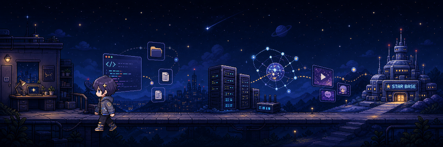

# 雨墨星辰

**不爱编程，但很爱让程序与 Agent 替我干活。**

*I build small tools for problems I actually have.*

<picture>
  <source srcset="./assets/orbital-base.webp" type="image/webp">
  
</picture>

## 正在折腾

| 自动化工具 | 自托管服务 | 动漫媒体整理 |
| --- | --- | --- |
| 把重复操作交给程序 | 让数据和服务掌握在自己手里 | 把混乱的文件整理成可维护的媒体库 |

## 一些能用的东西

### [AutoAnime](https://github.com/ymxc152/AutoAnime)

从番剧文件整理脚本逐步演化为安全、可确认、可回滚的媒体整理管线，目前正在探索 Agent 辅助识别。

### [gdut-auto-login](https://github.com/ymxc152/gdut-auto-login)

适用于 Windows 10/11 的 GDUT 校园网连接工具，支持掉线恢复、后台运行、日志与自动更新。

## 更多

- [个人网站](https://www.ymxc152.top)
- [我的博客](https://blog.ymxc152.top)

  
   
  

<!-- 发布仓库并首次运行 snake.yml 后，再启用下面的贡献蛇：
<picture>
  <source media="(prefers-color-scheme: dark)" srcset="https://raw.githubusercontent.com/ymxc152/ymxc152/output/github-contribution-grid-snake-dark.svg">
  <source media="(prefers-color-scheme: light)" srcset="https://raw.githubusercontent.com/ymxc152/ymxc152/output/github-contribution-grid-snake.svg">
  
</picture>
-->
