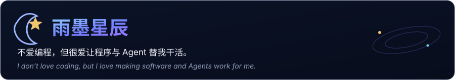
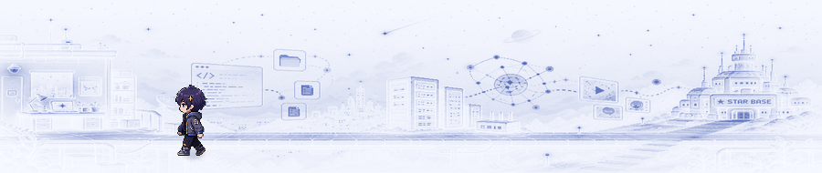
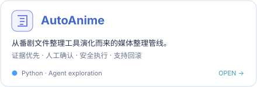
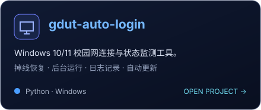

<picture>
  <source srcset="./assets/orbital-base-light.webp" type="image/webp">
  
</picture>

  
  

  <a href="https://www.ymxc152.top">个人网站</a>
  ·
  <a href="https://blog.ymxc152.top">我的博客</a>
  ·
  <a href="https://github.com/ymxc152/AutoAnime">AutoAnime</a>
  ·
  <a href="https://github.com/ymxc152/gdut-auto-login">gdut-auto-login</a>

<picture>
  <source media="(prefers-color-scheme: dark)" srcset="https://raw.githubusercontent.com/ymxc152/ymxc152/output/github-contribution-grid-snake-dark.svg">
  
</picture>

